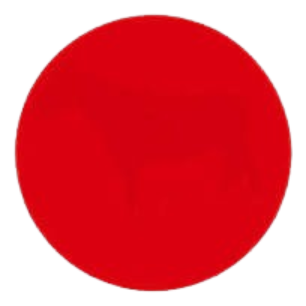
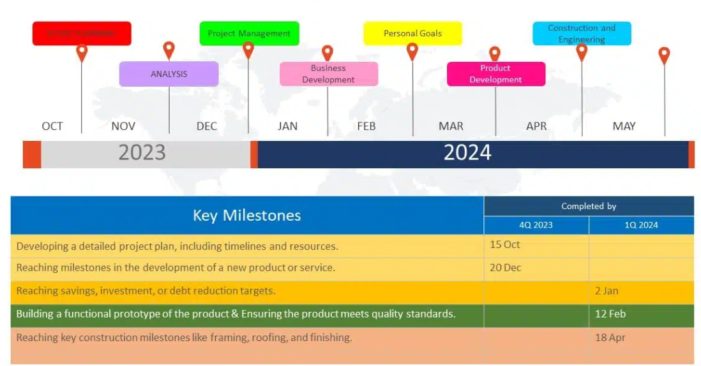
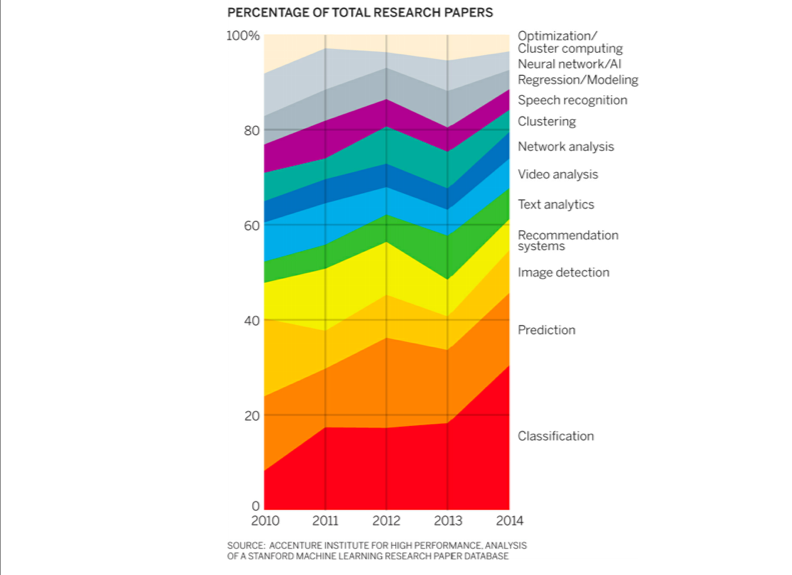
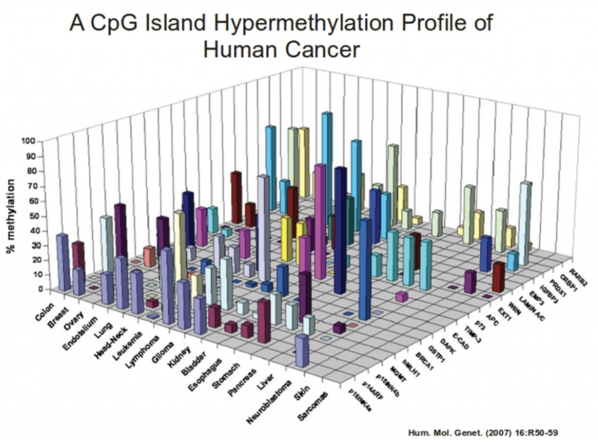
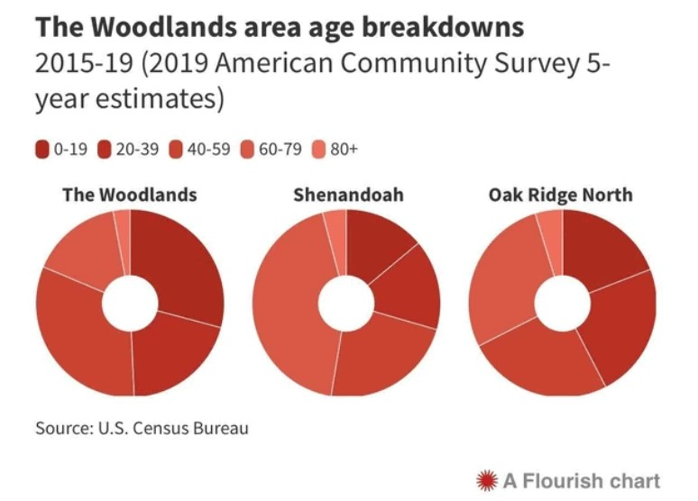
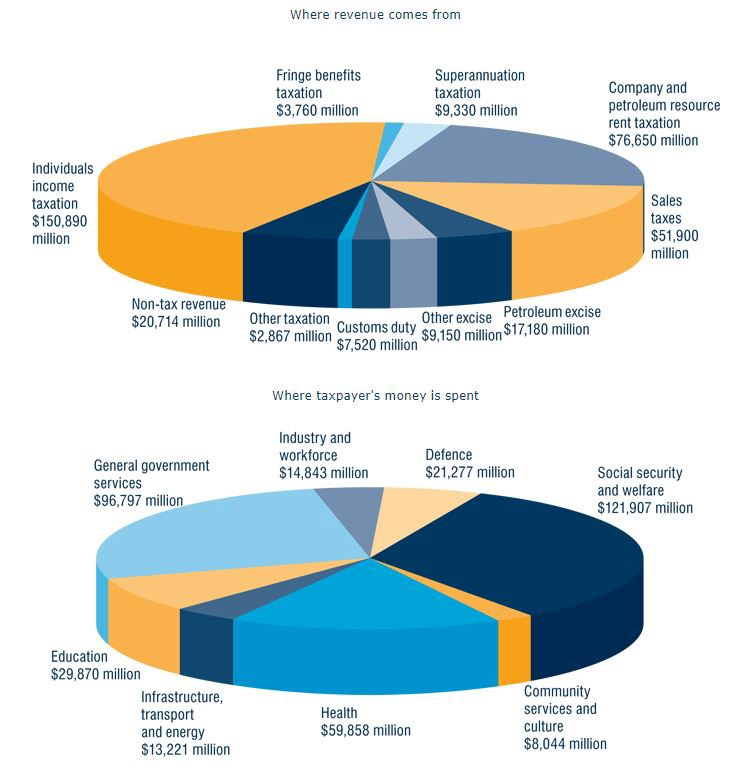
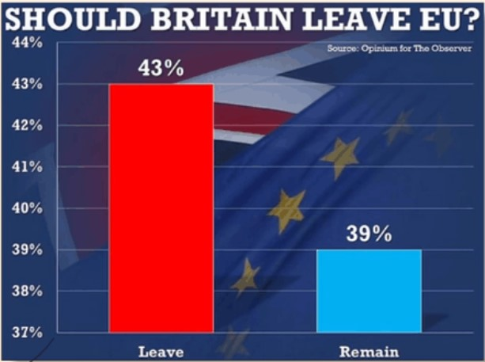
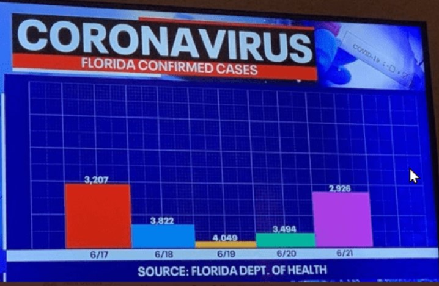

```{r setup, include=FALSE}
options(htmltools.dir.version = FALSE)
if (!require("knitr")) {
   install.packages("knitr")
   library(knitr)
}
if (!require("pander")) {
   install.packages("pander")
   library(pander)
}
if (!require("plotly")) {
   install.packages("plotly")
   library(plotly)
}
if (!require("ggplot2")) {
   install.packages("ggplot2")
   library(ggplot2)
}
#install.packages("devtools")
#devtools::install_github('emitanaka/anicon')
knitr::opts_chunk$set(
                  fig.width=3, 
                  fig.height=3, 
                  fig.retina=12,
                  out.width = "100%",
                  cache = FALSE,
                  echo = TRUE,
                  message = FALSE, 
                  warning = FALSE,
                  hiline = TRUE
                  )
```

```{r xaringan-themer, include=FALSE, warning=FALSE}
library(xaringanthemer)
  style_duo_accent(primary_color = "#1F4257",
          secondary_color = "#380F2A",
          # fonts
          header_font_google = google_font("Martel"),
          text_font_google = google_font("Lato"),
          code_font_google = google_font("Fira Mono"))
```

name:toc
class:inverse5, middle

# Table of Contents
<!--h1 align="center"> Table of Contents</h1-->
<BR>

<!--[](#Presentclear) -->
<table align="center", width = "50%">
<tr>
<td style="text-size:50px; line-height: 1.5; font-variant:small-caps">

 <font size = 8><b> Poor Slide Design </b></font>
 <br><br>
 <font size = 8> <b> Poor Visual Design </b></font><br>
</td>
</tr>
</table>


---
class:inverse1 middle center
name:storytelling


# Good or Bad Slide Designs?


---
name:Presentclear

# <font color="#70384A"> Oral Presentation Assessment </font>

<table align="center", width = "95%">

<tr>
<td style="line-height: 1.5; font-variant:small-caps; text-color:#70384A;">
<ul>
<li> <b>Organization</b></li>
   <ul>
  <li>  Presentation is appropriate for the topic and audience</li>
  <li>  A clear opening statement and purpose</li>
  <li>  Information presented in a logical sequence</li>
   </ul>
<li> <b>Pertinent</b></li>
 <ul>
  <li>  Design/layout: neat, clear, and visually appealing</li>
  <li>  Summarizes main points</li>
  </ul>

<li> <b>Content</b></li>
 <ul>
  <li>  Full understanding of the topics</li>
  <li>  Practical and analytic logic</li>
  <li>  The technical term well defined</li>
  <li>  Analytic justifications</li>
  <li>  Text content: straightforward, concise, and accurate</li>
  <li>  Reference (acknowledge other’s contributions)</li>
  </ul>
</ul>
</td>


<td style="line-height: 1.5; font-variant:small-caps; text-color:#70384A;">
<ul>

<li> <b>Quality of Conclusion</b></li>
 <ul>
  <li>  Well-justified and persuasive conclusions</li>
  <li>  Limitations and potential improvements</li>
  </ul>

<li> <b>Delivery</b></li>
 <ul>
  <li> Clear and audible voice</li>
  <li>  Projects enthusiasm, interest, and confidence.</li>
  <li>  Interaction with audience</li>
  <li>  Presentation time management</li>
  </ul>

<li>  <b>Visual Aids</b></li>
 <ul>
  <li>  Uses various visual tools to enhance the presentation</li>
  <li>  Effectively use colors and charts and avoid distraction</li>
  </ul>

<li> <b>Response to Questions</b></li>
 <ul>
  <li>  Demonstrates full knowledge of the topic</li>
  <li>  Explains and elaborate on all questions</li>
  </ul>
</ul>
</td>
</tr>

</table>


---
name:readable

<h1 align="center"><font color="#70384A"> Project Phases Planing</font></h1>

<table align="center", width = "80%">
<tr>
<td style="text-size:50px; line-height: 1.5; text-color:#70384A; font-face: 'Trebuchet MS', sans-serif;">


</td>
</tr>
</table>


---
class: inverse6

<h1 align="center"><font color="#70384A"> High Dimensional Data </font></h1>
<br><br><br><br><br><br><br>
<ul>
<li> 3D graphics?</li>
  <ul>
  <li> 3D is generally not recommended in Dataviz!
  </ul>
<li> High dimensional data with 2D representation
  <ul>
  <li> Use of color coding, movements, different types of marks, tooltip messages, interactive tools, etc.
  </ul>
 <li> <b>Example</b>: Life Expectation vs Total Fertility Over the years by some geographical regions.
<ul>


---
class: inverse7

<h1 align="center"><font color="#70384A"> Antarctica Penguins</font></h1>
<br>

.pull-left[
Considered by many to be the signature species of Antarctica, penguins are charismatic little creatures that win the heart of most tourists who visit the White Continent on an Antarctica cruise.


17 species of penguins are found worldwide, however, only 7 reside in the antarctic region and can be considered truly Antarctica penguins.

These are Adélies, Kings, Chinstraps, Emperors, Gentoos, Macaroni, and Rockhoppers.


Penguins are flightless birds, instead they’re designed to swim. Their powerful paddle muscles and sleek hydrodynamic shape makes them extremely quick in the water, often reaching speeds of 25 mph.


Antarctica penguins are very well adapted to the cold. Their oily feathers, which gives penguins that distinguished well dressed look, do not allow water to pass through to their skin.


]

.pull-right[

Underneath the outer feather layer is thick layer of fat which keep penguins so warm that they often need to fluff up their feathers to cool down.


Although Antarctica penguins have poor eyesight on land, their vision underwater is incredibly good. Like many Antarctica marine animals, penguins eyesight underwater picks up the green and blue hues of the sea exceptionally well.


Seals use their keen eyesight to catch prey and to avoid predators such as Leopard seals Killer whales.


Antarctica penguins generally feed on small fish and krill. It is easy to determine the diet of a particular penguin as penguins that eat krill excrete pink guano whilst penguins that consume fish have white guano.
]


---
name:overusetech

<h1 align="center"><font color="#70384A"> Consistency in Slide Design</font></h1>
<br>

<b><center><font color = "navy" size = 5>
```{r  echo =FALSE}
anicon::nia("1. Choose a theme and stick to it.", animate = "pulse")
```
</font>

<br>

<font color = "Red" size = 5>
```{r  echo =FALSE}
anicon::nia("2. Maintain the key design elements.", animate = "float")
```
</font>

<br>

<font color = "green" size = 5>
```{r  echo =FALSE}
anicon::nia("3. Use of dominant and secondary colors.", animate = "bounce")
```
</font>

<br>

```{r  echo =FALSE}
anicon::nia("4. Font and background consistency.", animate = "passing")
```

<br>

```{r  echo =FALSE}
anicon::nia("5. Consistency of bullets point and alternatives.", animate = "vertical")
```
</center></b>


---

name: colors

<h1 align="center"> Making Custom Colors</font></h1>

<center><div class='wrap'>
<iframe src="https://colordesigner.io/color-mixer" height="500px" width="100%" style="border:1px solid black;"></iframe>
</div></center>


---
class:inverse1 middle center
name:storytelling


<font color = "white" size = 7><b>
```{r  echo =FALSE}
anicon::nia("Good or Bad Graphical Designs?", animate = "pulse")
```
<b></font>


---
name:visuals

# <font color="#70384A"> Machine Learning Algorithms </font> 
<center>

</center>


---


# <font color="#70384A"> Joint Distribution </font> 
<center>

</center>


---

# <font color="#70384A"> Comparing Categorical Distributions </font> 
<center>

</center>


---

# <font color="#70384A"> Frequency Distributions </font> 
<center>

</center>


---

# <font color="#70384A"> Distribution or Trend? </font> 
<br>
.pull-left[
<center>

</center>
]

.pull-right[
<center>

</center>
]


---
name:Thanks
class: inverse1 center, middle

# Thanks!

Slides created using R packages:

[**xaringan**](https://github.com/yihui/xaringan)<br>
[**gadenbuie/xaringanthemer**](https://github.com/gadenbuie/xaringanthemer)<br>
[**knitr**](http://yihui.name/knitr)<br>
[**R Markdown**](https://rmarkdown.rstudio.com)<br>
via <br>
[**RStudio Desktop**](https://posit.co/download/rstudio-desktop/)
