```{r setup, include=FALSE}
options(htmltools.dir.version = FALSE)
if (!require("knitr")) {
   install.packages("knitr")
   library(knitr)
}
if (!require("pander")) {
   install.packages("pander")
   library(pander)
}
if (!require("plotly")) {
   install.packages("plotly")
   library(plotly)
}
if (!require("ggplot2")) {
   install.packages("ggplot2")
   library(ggplot2)
}
knitr::opts_chunk$set(
                  fig.width=3, 
                  fig.height=3, 
                  fig.retina=12,
                  out.width = "100%",
                  cache = FALSE,
                  echo = TRUE,
                  message = FALSE, 
                  warning = FALSE,
                  hiline = TRUE
                  )
```

```{r xaringan-themer, include=FALSE, warning=FALSE}
library(xaringanthemer)
  style_duo_accent(primary_color = "#1F4257",
          secondary_color = "#380F2A",
          # fonts
          header_font_google = google_font("Martel"),
          text_font_google = google_font("Lato"),
          code_font_google = google_font("Fira Mono"))
```

name:toc
class:inverse1, top

# Table of Contents
<!--h1 align="center"> Table of Contents</h1-->
<BR>

<!--[](#Presentclear) -->
<table align="center", width = "50%">
<tr>
<td style="text-size:50px; line-height: 1.5; font-variant:small-caps">

 <font size = 6> <b> Make slides clear and readable. </b></font>
 <br>
 <font size = 6> <b> Keep slides simple and consistent. </b></font> <br>
 <font size = 6> <b> Effectively using visuals. </b></font><br>
 <font size = 6> <b> Effectively using web technologies. </b></font><br>
 <font size = 6> <b> Using graphics effectively. </b></font><br>
 <font size = 6> <b> Using colors cautiously. </b></font><br>
<font size = 6> <b> Effectively delivering presentation. </b></font><br>
<font size = 6> <b> Avoiding common mistakes. </b></font>
</td>
</tr>
</table>

[](#toc0) 
[](#storytelling)

---
class:inverse middle center
name:storytelling


# Presentation is all about storytelling! 

[](#toc) 
[](#Presentclear)


---
name:Presentclear

# <font color="#70384A"> Make Presentation Clear </font>
<br>

<table align="center", width = "60%">
<tr>
<td style="line-height: 1.5; font-variant:small-caps; text-color:#70384A;">
<font size = 6 color = "#70384A"> Overall: concise, simple and relevant.</font><br>
 
 <font size = 6 color = "#70384A"> Content in logical structure.</font><br>
 
 <font size = 6 color = "#70384A"> One theme per slide. </font><br> 
 
 <font size = 6 color = "#70384A"> Using keywords and phrases.</font><br>
 
 <font size = 6 color = "#70384A"> Use less sentences, avoid paragraphs.</font><br> 
 
 <font size = 6 color = "#70384A"> Aesthetics of tables and graphics.</font><br> 
 
 <font size = 6 color = "#70384A"> Using LaTex equations if necessary. </font>
</td>
</tr>
</table>

[](#story-telling) 
[](#readable) 


---
name:readable

<h1 align="center"><font color="#70384A"> Make Slides Readable </font></h1>
<br>

<table align="center", width = "60%">
<tr>
<td style="text-size:50px; line-height: 1.5; text-color:#70384A; font-face: 'Trebuchet MS', sans-serif;">
 <font size = 6 color = "#70384A"> Use web safe fonts.</font><br>
 
 <font size = 6 color = "#70384A"> Use readable font size. </font><br>
 
 <font size = 6 color = "#70384A"> Use consistent font face.</font><br> 
 
 <font size = 6 color = "#70384A"> Avoid blocks of text.</font><br>
 
 <font size = 6 color = "#70384A"> Avoid capitalized text.</font><br> 
 
 <font size = 6 color = "#70384A"> Highlight aesthetics of visuals.</font><br> 
 
 <font size = 6 color = "#70384A"> Use LaTex equations if necessary. </font><br>

</td>
</tr>
</table>

[](#Presentclear) 
[](#overdesign)  
 

---
name:overdesign

<h1 align="center"><font color="#70384A"> Avoiding Over-design </font></h1>
<br>

<table align="center", width = "60%">
<tr>
<td style="line-height: 1.5;  font-face: 'Trebuchet MS', sans-serif;">

<font size = 6 color = "#70384A"> Avoiding cluttering information.</font><br>

 <font size = 6 color = "#70384A"> Avoiding unnecessary information.</font><br> 
 
 <font size = 6 color = "#70384A"> Avoid crowding slides by splitting.</font><br>
 
 <font size = 6 color = "#70384A"> Avoid distracting background.</font><br> 
 
 <font size = 6 color = "#70384A"> Avoid over decoration.</font><br> 
 
 <font size = 6 color = "#70384A"> Avoid too many animations.</font><br> 
 
  <font size = 6 color = "#70384A"> Avoid text-heavy slides.</font><br>
  
</td>
</tr>
</table>

[](#readable) 
[](#overusetech)


---
name:overusetech

<h1 align="center"><font color="#70384A"> Overusing Technology</font></h1>
<br>

<table align="center", width = "70%">
<tbody >
<tr style= "line-height: 1.5; font-face: 'Trebuchet MS', sans-serif;">
<td>

<font size = 6 color = "#70384A"> Aim to communicate not tech showcase.<br>

 Use animations sparingly.<br> 
 
 Use sound and video only if needed.<br>
 
 Avoid using sound if possible.<br>
 
 Use video only if needed.<br>
 
Avoid using sound and video the same time.<br> 
 
Avoid switching to different tech platform<br> 
 </font>
</td>
</tr>
</tbody>
</table>

[](#overusetech) 
[](#consistency)


---
name:consistency

# <font color="#70384A"> Consistent Design Presentation Slides </font> 
<br>

<table align="center", width = "70%">
<tbody >
<tr style= "line-height: 1.5; font-face: 'Trebuchet MS', sans-serif;">
<td>

<font size = 6 color = "#70384A"> Choose a theme and stick to it.<br>

 Maintain the key design elements.<br> 
 
 Use of dominant and secondary colors. <br>
 
 Font and background consistency. <br>
 
 Consistency of bullets point and alternatives.<br>

</font>
</td>
</tr>
</tbody>
</table>

[](#overusetech) 
[](#visuals)


---
name:visuals

# <font color="#70384A"> Use and Create Visual Contents </font> 
<br>

<table align="center", width = "70%">
<tbody >
<tr style= "line-height: 1.5; font-face: 'Trebuchet MS', sans-serif;">
<td>

<font size = 6 color = "#70384A">Visual contents: tables and graphs<br>

 Visuals for communication not decoration.<br>

 Use of complementary and analogous colors. <br>
 
 Controlling size of tables and graphs<br>
 
 Visuals must be readable.<br>

 No more than two visuals per slide.<br>

 Right visual for right information.<br>


</font>
</td>
</tr>
</tbody>
</table>

[](#consistency) 
[](UsingColors)

---
name:UsingColors

# <font color="#70384A"> Use Colors Effectively </font> 
<br>

<table align="center", width = "70%">
<tbody >
<tr style= "line-height: 1.5; font-face: 'Trebuchet MS', sans-serif;">
<td>

<font size = 6 color = "#70384A"> Color contrast. <a href="https://accessibleweb.com/color-contrast-checker/" target="_blank" 
     onclick="window.open('https://accessibleweb.com/color-contrast-checker/','name',
                   'width=1200,height=1000)"> [Color contrast checker 
                   ]</a> <br>

<font size = 6 color = "#70384A"> Color meanings. <a href="img/ColorEmotion.png" target="_blank" 
     onclick="window.open('img/ColorEmotion.png','name',
                   'width=1400,height=800)"> [Color psychology 
                   ]</a> <br>


 Avoidance of color combination.<br>

 Dark background with light text and graphics. <br>
 
 Light background with dark text and graphics<br>
 
 Using background graphics with caution.<br>

</font>
</td>
</tr>
</tbody>
</table>

[](#visuals) 
[](#DeliveryPresentation01)


---
name:DeliveryPresentation01

# <font color="#70384A"> Delivering A Good Presentation I </font> 
<br>

<table align="center", width = "55%">
<tbody >
<tr style= "line-height: 1.5; font-face: 'Trebuchet MS', sans-serif;">
<td>

<div class="hover_img">
     <a href=""><font color="#70384A" size= 6>Know your audience.</font><span>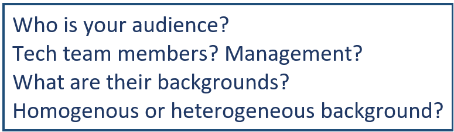</span></a>
</div>

<div class="hover_img">
     <a href=""><font color="#70384A" size= 6>Think about an impressive start.</font><span>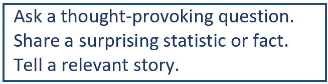</span></a>
</div>

<div class="hover_img">
     <a href=""><font color="#70384A" size= 6>Speak with passion.</font><span>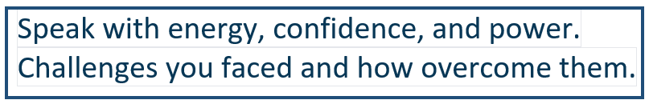</span></a>
</div>

<div class="hover_img">
     <a href=""><font color="#70384A" size= 6>Keep it simple and short.</font><span>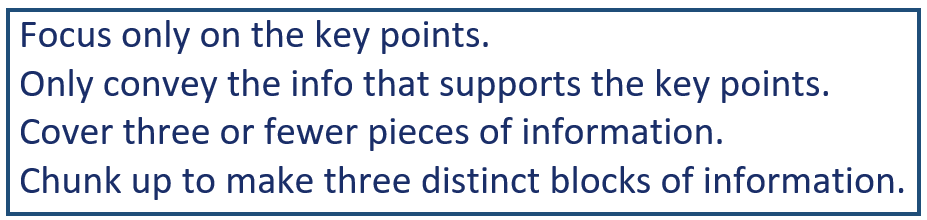</span></a>
</div>
 
</font>
</td>
</tr>
</tbody>
</table>

[](#UsingColors) 
[](#DeliveryPresentation02)


---
name:DeliveryPresentation02

# <font color="#70384A"> Delivering A Good Presentation II </font> 
<br>

<table align="center", width = "50%">
<tbody >
<tr style= "line-height: 1.5; font-face: 'Trebuchet MS', sans-serif;">
<td>

<div class="hover_img">
     <a href=""><font color="#70384A" size= 6>Effective use of voice.</font><span>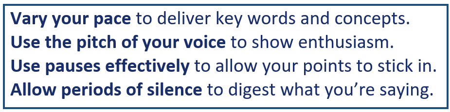</span></a>
</div>
 
<div class="hover_img">
     <a href=""><font color="#70384A" size= 6>Maintain eye contact.</font><span>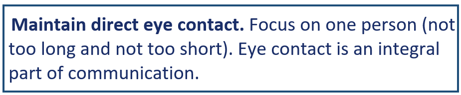</span></a>
</div>
 
<div class="hover_img">
     <a href=""><font color="#70384A" size= 6>Use body language.</font><span>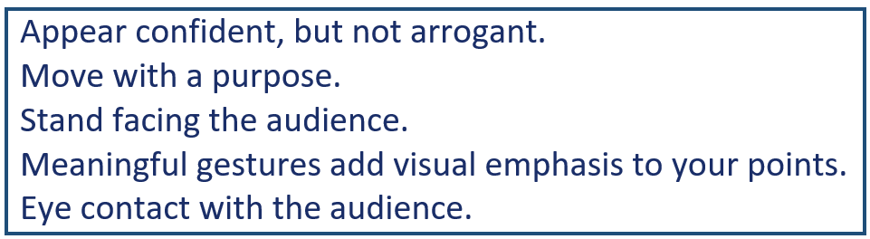</span></a>
</div>

<div class="hover_img">
     <a href=""><font color="#70384A" size= 6>Deal with nervousness.</font><span>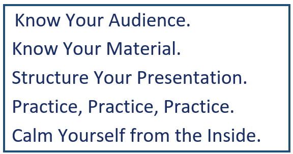</span></a>
</div>


</font>
</td>
</tr>
</tbody>
</table>

[](#DeliveryPresentation01) 
[](#CommonMistakes)


---
name:CommonMistakes

# <font color="#70384A"> Common Mistakes </font> 
<br>

<table align="center", width = "75%">
<tbody >
<tr style= "line-height: 1.5; font-face: 'Trebuchet MS', sans-serif;">
<td>

<div class="hover_img">
     <a href=""><font color="#70384A" size= 6>Ignoring the audience.</font><span>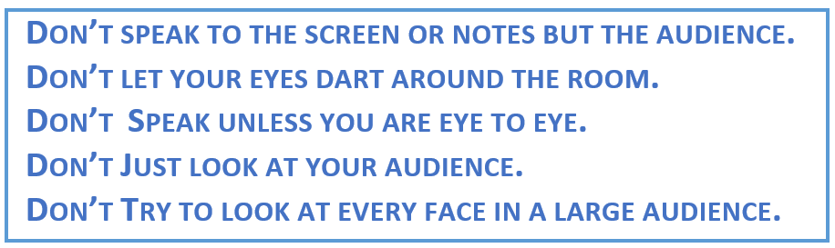</span></a>
</div>

<div class="hover_img">
     <a href=""><font color="#70384A" size= 6>Expecting visuals to do presentation for you.</font><span>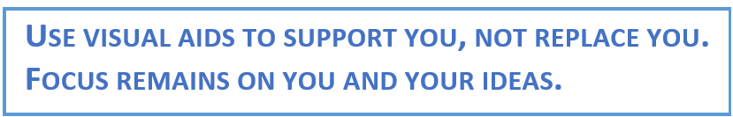</span></a>
</div>
 
<div class="hover_img">
     <a href=""><font color="#70384A" size= 6>Spending more time on slides than presentation.</font><span>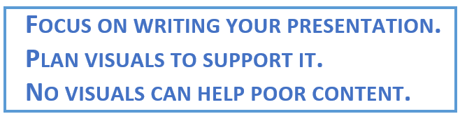</span></a>
</div>

<div class="hover_img">
     <a href=""><font color="#70384A" size= 6>Reading directly from slides.</font><span>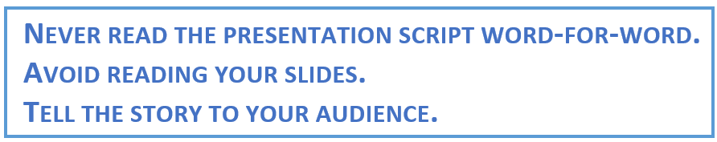</span></a>
</div>
 
<font color="#70384A" size= 6> 
 Inadequate preparation and rehearsal.<br>
 
 Turning all the lights off.<br>

 <font color="#70384A" size= 6>Hiding in the corner.<br>

</font>
</td>
</tr>
</tbody>
</table>

[](#DeliveryPresentation02) 
[](#Thanks)


---
name:Thanks
class: inverse1 center, middle

# Thanks!

Slides created using R packages:

[**xaringan**](https://github.com/yihui/xaringan)<br>
[**gadenbuie/xaringanthemer**](https://github.com/gadenbuie/xaringanthemer)<br>
[**knitr**](http://yihui.name/knitr)<br>
[**R Markdown**](https://rmarkdown.rstudio.com)<br>
via <br>
[**RStudio Desktop**](https://posit.co/download/rstudio-desktop/)
