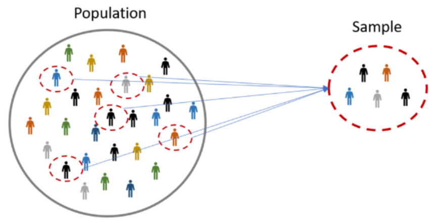

```{=html}
<style type="text/css">
h1.title {
  font-size: 24px;
  color: DarkRed;
  text-align: center;
}
h4.author { /* Header 4 - and the author and data headers use this too  */
    font-size: 18px;
  font-family: "Times New Roman", Times, serif;
  color: DarkRed;
  text-align: center;
}
h4.date { /* Header 4 - and the author and data headers use this too  */
  font-size: 18px;
  font-family: "Times New Roman", Times, serif;
  color: DarkBlue;
  text-align: center;
}
h1 { /* Header 3 - and the author and data headers use this too  */
    font-size: 22px;
    font-family: "Times New Roman", Times, serif;
    color: darkred;
    text-align: center;
}
h2 { /* Header 3 - and the author and data headers use this too  */
    font-size: 18px;
    font-family: "Times New Roman", Times, serif;
    color: navy;
    text-align: left;
}

h3 { /* Header 3 - and the author and data headers use this too  */
    font-size: 15px;
    font-family: "Times New Roman", Times, serif;
    color: navy;
    text-align: left;
}

h4 { /* Header 4 - and the author and data headers use this too  */
    font-size: 18px;
    font-family: "Times New Roman", Times, serif;
    color: darkred;
    text-align: left;
}
</style>
```


```{r setup, include=FALSE}
# code chunk specifies whether the R code, warnings, and output 
# will be included in the output files.
if (!require("knitr")) {
   install.packages("knitr")
   library(knitr)
}
if (!require("lessR")) {
   install.packages("lessR")
   library(lessR)
}
knitr::opts_chunk$set(echo = TRUE, 
                      warning = FALSE,  
                      result = TRUE,
                      message = FALSE,
                      comment = NA
                      )   
```


#	Basic Concepts of Sampling Design

```{r echo = FALSE, fig.align='center', out.width="50%", fig.cap="Sampling population."}

```

This section introduces the basic concepts of sampling design and analysis.

**Population**:  Total of items about which information is desired. It can be classified into two categories - finite and infinite. 

*Finite Population* - The population is said to be finite if it consists of a fixed number of elements so that it is possible to enumerate in its totality.  

*Infinite population* - The number of items is infinite. 

From practical consideration, we use the term infinite population for a population that cannot be enumerated in a reasonable period of time. 
 
 
**Sample**: It is part of the population that represents the characteristics of the population.
  
**Sampling**: It is the process of selecting the sample for estimating the population characteristics. In other words, it is the process of obtaining information about an entire population by examining only a part of it. 
  
**Sampling  Unit**: Elementary units or groups of such units which besides being clearly defined, identifiable, and observable, are convenient for the purpose of sampling are called sampling units.  
In a crop survey, a farm or a group of farms owned or operated by a household may be considered as the sampling unit. 
  
**Sampling Frame**:  A list containing all sampling units is known as a sampling frame.  The sampling frame consists of a list of items from which the sample is to be drawn. 
  
**Sample Survey**:  An investigation in which elaborate information is collected on a sample basis is known as a sample survey. 
  
**Statistic**: Characteristics of the sample. For example, sample Mean, proportion, etc. 
  
**Parameter**: Characteristics of the population. For example, population Mean, proportion, etc. 
  
**Target Population**:  A target population is the entire group about which information is desired and conclusions are made. 
  
**Sampled Population**:  The population, that we actually sample, is the 
sampled population. It is also called the survey population.

# Purples of Sampling
The basic purpose of sampling is to provide an estimate of the population parameter and to test the hypothesis. The advantages of sampling are - 
 
*	Save time and money.  

*	Enable collection of comprehensive data.  
 
*	Enable more accurate measurement as it is conducted by trained and experienced investigators.  
 
* Sampling remains the only way when the population contains infinitely many members. 

*	In certain situations, sampling is the only way of data collection. For example, in testing the pathological status of blood, boiling status of rice, etc. 
 
*	It provides a valid estimation of sampling error.

# Sampling Process

The sampling process comprises several stages

1. Define the population. 

2. Specifying the sampling frame. 

3. Specifying the sampling unit. 

4. Selection of the sampling method. 

5. Determination of sample size. 

6. Specify the sampling plan. 

7. Selecting the sample. 
 
## Defining the Population 

The population must be defined in terms of elements, sampling units, extent, and time. Because there is very rarely enough time or money to gather information from everyone or everything in a population, the goal becomes finding a representative sample (or subset) of that population. 
 
## Specifying Sampling Frame

As a remedy, we seek a sampling frame that has the property that we can identify every single element and include any in our sample. The most straightforward type of frame is a list of elements of the population  (preferably the entire population) with appropriate contact information.

A sampling frame may be a telephone book, a city directory, an employee roster, a listing of all students attending a university, or a list of all possible phone numbers. 
 
## Specifying Sampling Unit

A sampling unit is a basic unit that contains a single element or a group of elements of the population to be sampled. The sampling unit selected is often dependent upon the sampling frame. If a relatively complete and accurate listing of elements is available (e.g. register of purchasing agents) one may well want to sample them directly. If no such register is available, one may need to sample companies as the basic sampling unit.  
  
## Selecting Sampling Method

The sampling method outlines the way in which the sample units are to be 
selected. The choice of the sampling method is influenced by the objectives of the research, availability of financial resources, time constraints, and the nature of the problem to be investigated. All sampling methods can be grouped under two distinct heads, that is, probability and non-probability sampling. 
 
## Determining Sample Size 

The sample size calculation depends primarily on the type of sampling design used. However, for all sampling designs, the estimates for the expected sample characteristics (e.g. mean, proportion, or total) desired level of certainty, and the level of precision must be clearly specified in advance. The statement of the precision desired might be made by giving the amount of error that we are willing to tolerate in the resulting estimates. Common levels of precision are 5% and 10%. 
 
## Specifying Sampling Plan

In this step, the specifications and decisions regarding the implementation of the research process are outlined. As the interviewers and their co-workers will be on field duty most of the time, a proper specification of the sampling plans would make their work easy, and they would not have to revert to operational problems.

## Selecting the Sample

The final step in the sampling process is the actual selection of the sample elements. This requires a substantial amount of office and fieldwork, particularly if personal interviews are involved. 

# Sampling Methods

There are two basic approaches to sampling: Probability Sampling and Non-probability Sampling. We only focus on methods of probability sampling plans.  

Probability sampling is also known as random sampling or chance sampling. In this, *sample is taken in such a manner that each and every unit of the population has an equal and positive chance of being selected*. In this way, it is ensured that the sample would truly represent the overall population. Probability sampling can be achieved by random selection of the sample among all the units of the population. Major random sampling procedures are   

*	Simple Random Sample   
*	Systematic Random Sample   
*	Stratified Random Sample, and   
*	Cluster/ Multistage Sample.  

## Simple Random Sample
 
In a simple random variable (SRS), each member of the population is numbered. Then, a given size of the sample is drawn with the help of a random number generator (chart). It is relatively simple to implement but the final sample may miss out on small subgroups.  

 *Advantages*: The sample will be free from Bias (i.e. it’s random!).
 
*Disadvantages*: SRS is difficult to obtain due to its randomness. If the sample size is small, it could generate a result that is completely off the true value of the parameter and is also difficult to spot. Increasing the sample size is the best way to eradicate this problem.  

## Systematic  Random  Sample  

It also requires numbering the entire population. Then every nth number (say every 5th or 10th number, as the case may be) is selected to constitute the sample. It is easier and more likely to represent different subgroups.  

 *Advantages*: Can eliminate other sources of bias. 
 
*Disadvantages*: This can introduce bias where the pattern used for the samples coincides with a pattern in the population. 

## Stratified Random Sample 

At first, the population is divided into groups or strata each of which is homogeneous with respect to the given characteristic feature.  From each stratum, then, samples are drawn at random. This is called stratified random sampling. For example, with respect to the level of socio-economic status, the population may first be grouped in such strata as high, middle, low, and very low socio-economic levels as per pre-determined criteria, and a random sample drawn from each group.

 The sample size for each sub-group can be fixed to get a representative sample. This way, it is possible that different categories in the population are fairly represented in the sample,  which could have been left out otherwise in a simple random sample. 
 
 *Advantages*:   Yields more accurate results than simple random sampling.  
Can show different tendencies within each category (e.g. men and women).  
*Disadvantages*:   Nothing major, hence it’s used a lot.  
 
As with stratified samples, the population is broken down into different categories. However, the size of the sample of each category does not reflect the population as a whole. The Quota sampling technique can be  used where an unrepresentative sample is desirable (e.g. you might want  to interview more children than adults for a survey on computer games),  or where it would be too difficult to undertake a stratified sample

## Cluster/ Multistage Sample

In some cases, the selection of units may pass through various stages, before you finally reach your sample of study. For this, a State, for example, may be divided into districts, districts into blocks, blocks into villages, and villages into identifiable groups of people, and then the random or quota sample from each group. 

For example, taking a random selection of 3 out of 15 districts of a State, 6 blocks from each selected district, 10 villages from each selected block, and 20 households from each selected village, totaling 3600 respondents. This design is used for large-scale surveys spread over large areas.

The advantage is that it needs a detailed sampling frame for selected clusters only rather than for the entire target area. There are savings in travel costs and time as well. 

However, there is a risk of missing important sub-groups and not having a complete representation of the target population. 

*Advantages*:  Less expensive and time-consuming than a fully random sample. Can show ‘regional’ variations.  

*Disadvantages*:  Not a genuine random sample. Likely to yield a biased result (especially if only a few clusters are sampled). 

# Sampling Error and Survey Bias

Survey results are typically subject to some error. Total errors can be classified into sampling errors and non-sampling errors. The term ‘error’ here includes systematic biases as well as random errors. 

## Sampling errors and biases: 

Sampling errors and biases are induced by the sample design.  They include

* Selection bias: When the true selection probabilities differ from those assumed in calculating the results. 
 
*	Random sampling error: Random variation in the results due to the elements in the sample being selected at random. 

**Non-sampling error**  Non-sampling errors are other errors that can impact the final survey estimates, caused by problems in data collection, processing, or sample design. They include
 
 *Over-coverage*: Inclusion of data from outside of the population. 
 
 *Under-coverage*: Occurs when some members of the population are inadequately represented in the sample. Under-coverage is often a problem with convenience samples. 

**Measurement error**: When respondents misunderstand a question or find it difficult to answer.

**Processing error**: Mistakes in data coding.

**Non-response**: Failure to obtain complete data from all selected individuals. 

After sampling, a review should be held of the exact process followed in sampling, rather than that intended, in order to study any effects that any divergences might have on subsequent analysis. 
 
## Bias Due to Measurement Error 

A poor measurement process can also lead to bias. In survey research, the measurement process includes the environment in which the survey is conducted, the way that questions are asked, and the state of the survey respondent. 

**Response bias** refers to the bias that results from problems in the measurement process. For example, a satisfaction survey may ask the respondent to indicate where she is satisfied, dissatisfied, or very dissatisfied. By giving the respondent one response option to express satisfaction and two response options to express dissatisfaction, this survey question is biased toward getting a dissatisfied response. This becomes more serious if the survey response is socially sensitive.

 Increasing the sample size tends to reduce the sampling error; that is, it makes the sample statistic less variable. However, increasing the sample size does not affect survey bias. A large sample size cannot correct the methodological problems (under-coverage, non-response bias, etc.) that produce survey bias. 


# Sample Size Determination

Determination of sample size is probably one of the most important phases in the sampling process. 

From a theoretical perspective, the larger the sample size, the better the estimation. However, as the sample size reaches a certain size, the impact on the estimate will become negligible. On the other hand, sampling can be expensive. If the sampling precision is pre-specified, we only choose the appropriate size to meet the precision without wasting resources.

For example, if the estimate of the **mean** of the population is required to be within $\pm 3$ of the true mean with 95% confidence. That is, if the true mean is 100, the estimated value of the mean will be no less than 97 and no more than 103. In other words, all this means that the acceptable error, e, is equal to 3. 

The methods of determining the sample size are dependent on the specific estimation tasks such as population means, variance, correlations, etc.  In other words, there is no single algorithm that fits all sample size determination problems because it is one type of statistics problem just like the problems of statistical hypothesis. 


## Problems of Estimating Mean and Proportion

The above example explained the idea of estimating the population mean with a pre-specified estimation error ($\pm 3$). The acceptable estimation error is, in fact, the margin of error in the confidence interval which is given by

$$
\bar{x} \pm \text{CV}_{\alpha/2}\frac{\sigma}{\sqrt{n}}
$$

where $E =  \text{CV}_{\alpha/2}\sigma/\sqrt{n}$ is the margin error (i.e., pre-specified estimation error).

In other words, if estimation error $E$ and confidence level $100(1-\alpha)\%$ is given, we can then solve for the desired sample size $n$ by the following formula

$$
n = \left[ \frac{\sigma}{\text{CV}_{\alpha/2}}\right]^2
$$

The formula for determining the sample size of estimating a population proportion with a given estimation error and confidence level is given by

$$
n = \left[ \frac{\sqrt{\hat{p}(1-\hat{p})}}{\text{CV}_{\alpha/2}}\right]^2
$$

## Estimating Variance and Other Characteristics

The derivation of formulas for calculating sample size for estimating variance or other population characteristics is not straightforward. Since this is not the focus of this course, we will not expand the discussion in any direction. 

## Sample Size Determination and Power Calculation

Sample size determination in power analysis is another very important procedure in clinical studies. It is a required component in the *statistical analysis plan* (SAP) for intervention and non-intervention observational studies. We will also not expand the discussion from this direction.


