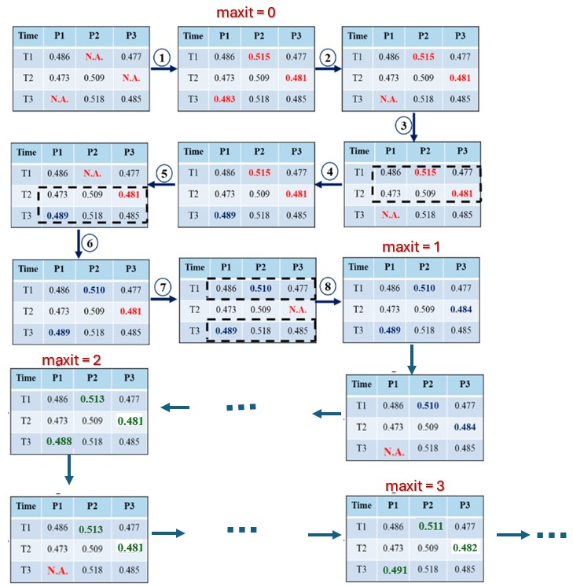

<style type="text/css">

div#TOC li {
    list-style:none;
    background-image:none;
    background-repeat:none;
    background-position:0;
}

h1.title {
  font-size: 20px;
  color: DarkRed;
  text-align: center;
}
h4.author { /* Header 4 - and the author and data headers use this too  */
    font-size: 18px;
  font-family: "Times New Roman", Times, serif;
  color: DarkRed;
  text-align: center;
}
h4.date { /* Header 4 - and the author and data headers use this too  */
  font-size: 18px;
  font-family: "Times New Roman", Times, serif;
  color: DarkBlue;
  text-align: center;
}
h1 { /* Header 3 - and the author and data headers use this too  */
    font-size: 22px;
    font-family: "Times New Roman", Times, serif;
    color: darkred;
    text-align: center;
}
h2 { /* Header 3 - and the author and data headers use this too  */
    font-size: 18px;
    font-family: "Times New Roman", Times, serif;
    color: navy;
    text-align: left;
}

h3 { /* Header 3 - and the author and data headers use this too  */
    font-size: 15px;
    font-family: "Times New Roman", Times, serif;
    color: navy;
    text-align: left;
}

h4 { /* Header 4 - and the author and data headers use this too  */
    font-size: 18px;
    font-family: "Times New Roman", Times, serif;
    color: darkred;
    text-align: left;
}
</style>

```{r setup, include=FALSE}
# code chunk specifies whether the R code, warnings, and output 
# will be included in the output files.
if (!require("webshot")) {
   install.packages("webshot")
   library(webshot)
}
if (!require("psych")) {
   install.packages("psych")
   library(psych)
}
if (!require("cocron")) {
   install.packages("cocron")
   library(cocron)
}
if (!require("knitr")) {
   install.packages("knitr")
   library(knitr)
}


# knitr::opts_knit$set(root.dir = "C:/Users/75CPENG/OneDrive - West Chester University of PA/Documents")
# knitr::opts_knit$set(root.dir = "C:\\STA490\\w05")

knitr::opts_chunk$set(echo = TRUE,       
                      warnings = FALSE,   
                      results = TRUE,   
                      message = FALSE,
                      comment = NA,
                      fig.align='center', 
                      fig.pos = 'ht')
```


# Introduction

Missing data are questions without answers or variables without observations. They are a common and significant challenge in the survey. They often influence the selection of a statistical method of analysis, and, depending on their severity, can undermine the confidence of analysis, or even result in wrong conclusions.

# Sources of Missing Data

Missing data occur in survey research due to various reasons.

* **Total Non-response**: a sampled subject does not participate in the survey. Total non-response results from refusals to participate in the survey, non-contacts (not-at-homes), and other reasons such as a language barrier, deafness, or being too ill to participate. 

* **Non-coverage**: a subject in the target population is not included in the survey’s sampling frame. It occurs when some subjects in the population of inference for the survey are not included in the survey’s sampling frame. These missing subjects have no chance of selection for the sample and hence go unrepresented. 

* **Item Non-response**: a responding sampled subject fails to provide acceptable responses to one or more of the survey items.  Item non-response may arise because 
  - a respondent refuses to answer an item because it is too sensitive, does not know the answer to the item, gives an answer that is inconsistent with answers to other items and hence is deleted in editing;
  - the interviewer fails to ask the question or record the answer. 

* **Partial Non-response**: Partial non-response falls between total and item non-response. Whereas total non-response relates to a failure to obtain any responses from a sampled subject and item non-response usually implies the failure to obtain responses for only a small number of survey items. Partial non-response involves a substantial number of item non-responses. It can occur, for instance,
  - when a respondent cuts off the interview in the middle, 
  - when a respondent in a panel survey fails to provide data for one or more of the waves of the panel, or 
  - when a respondent in a multi-phase survey provides data for some but not all phases of data collection. 


# Patterns and Mechanisms of Missing Data

Before choosing appropriate methods to handle missing data, we need to know the patterns and mechanisms of missing data.

## Missing Data Patterns

Missing data can be grouped according to the missing data pattern, which describes which values are observed and which values are missing in the data matrix. In general, missing data patterns can be roughly classified into a variety of groups, such as univariate, multivariate, monotone, non-monotone, and file matching (Little and Rubin, 2002).

A univariate missing pattern indicates a situation where missing data occur only in a single variable. As an extension of the univariate case, the multivariate missing pattern refers to missing data in a set of variables, either for the entire unit or for particular items in a questionnaire. 

* If a variable is missing for a particular subject not only at a specific time point but also at all subsequent time occasions, the missing data pattern for this individual is said to be a monotone missing pattern. 

* If a case is missing at a given time point and then returns at a later follow-up investigation, then the missing data pattern for this subject is referred to as the non-monotone missing data. 

In longitudinal data analysis, the non-monotone missing pattern can cause more problems than the monotone pattern and thus deserves close attention. There are more missing data patterns such as the latent-factor patterns with variables that are never observed. For each missing data pattern, there are corresponding statistical techniques to handle its impact on the quality of data analysis.

## Types of Missing Data Mechanisms

Missing data mechanisms concern the relationship between missing data and the values of variables in the data matrix. Given this focus, missing data mechanisms can be categorized into three classes: missing completely at random (MCAR), missing at random (MAR), and missing not at random (MNAR). 

* **Missing Completely at Random (MCAR)**: If missing data are unrelated to both the missing responses and the set of observed responses, the observed values are representative of the entire sample without missing values. This missing data mechanism is referred to as MCAR. This is the best we can hope for since we can simply ignore the records with missing components (list-wise deletion) without introducing bias to the data.


* **Missing at Random (MAR)**: If missing data depend on the set of observed responses but are unrelated to the missing values, the missing data are said to be MAR. For example, a registry examining depression may encounter data that are MAR if male participants are less likely to complete a survey about depression severity than female participants. That is, if the probability of completion of the survey is related to their sex (which is fully observed) but not the severity of their depression, then the data may be regarded as MAR.  Since there is a systematic relationship between the propensity of missing values and the observed data, but not the missing data. What it means, is that the missing data can be predicted by other variables in the data set. 


* **Missing Not at Random (MNAR)**: There is a pattern in the missing data that affects the primary dependent variables. We can extend the above "depression" example if participants with severe depression are more likely to refuse to complete the survey about depression severity. Since the sources of missing data are themselves unmeasured means that (in general) this issue cannot be addressed in analysis, and the estimate of effect will likely be biased. Missing not at random is the worst-case scenario. We should use MNAR data with caution since these missing data cannot be "recovered".


# Methods of Handling Missing Data

Methods of handling missing data are dependent on the missing data mechanisms.  We have briefly discussed three major types of missing mechanisms in the previous sections. Here is a summary of these mechanisms.

* In **MCAR**, the missing mechanism is independent of characteristics of either the observed data or the unobserved values in the data set.

* In **MAR**, the missing mechanism is entirely explained by the observed data, that is, after observed values are accounted for, missingness is randomly distributed.

* In **MNAR**, missing observations are dependent upon unobserved values; missingness cannot be accounted for by controlling for observed data.


In the subsequent sub-sections, we will outline the major methods used to handle missing data with different types of missing mechanisms.

## Listwise Deletion

Delete all data from any participant with missing values. If the sample is large enough, we likely can drop data without substantial loss of statistical power. Be sure that the values are missing at random and that you are not inadvertently removing a class of participants.

This method is used for MCAR and, occasionally, MAR. It is the easiest and simplest method among all other available methods.

The disadvantages are

* loss of valuable information;
* potential contribution to bias;
* loss of statistical power;

## Mean Replacement 

For variable “X” with missing values, take the mean of all included observations. Substitute the mean of “X” for missing values of “X”. This is a type of simple imputation method. 

It is valid for MCAR. The advantages are

* preserving the mean of the data set; 
* simple;
* allowing use of all observations

The disadvantages are

* artificially reducing the standard deviation of the data set, 
* distorting relationships between variables;
* yielding potentially biased estimates;
* producing results that are highly statistically significant, but inaccurate;


## Regression Replacement

This is another method of single imputation. It estimates the distribution of the missing variable(s), given covariates, takes a random draw from this distribution for each value then performs analysis as usual.

The regression replacement is valid for both MCAR and MAR. The advantages are 
* avoidance of  bias in estimating;
* simpler than multiple imputations;


The disadvantages are

* misrepresenting uncertainty of estimates; 
* more complicated than list-wise deletion or mean replacement
* reducing confidence intervals of estimates although theoretically unbiased. 


## Multiple Imputation

Multiple Imputation is the most sophisticated and, currently, most popular approach to take the regression idea further and take advantage of correlations between responses. 

It estimates the distribution (Bayesian posterior distribution) of the missing variable, given covariates; takes random draws from this distribution to produce multiple versions (usually 3–10) of an imputed data set; performs analysis on each imputed data set and pools the results. It is a simulation-based Bayesian method. Most statistical computer programs can do multiple imputations.

It is valid for MCAR or MAR. The advantages are

* accounting for the extra uncertainty produced by imputing data;
* producing better estimates of missing values.

The disadvantages are

* requiring complicated statistical methods or complicated software;
* harder to understand; 
* taking extra steps;
* because the method accounts for extra uncertainty, results can be interpreted as if data were not missing.

# R Packages for Imputation

Several R packages have functions to perform imputation for missing values. This section lists a few commonly used R libraries. We only explain the concepts with no coding.

## MICE Package

MICE (Multivariate Imputation via Chained Equations) is one of the commonly used packages by R users. Creating multiple imputations as compared to a single imputation (such as the mean) takes care of uncertainty in missing values.

MICE assumes that the missing data are Missing at Random (MAR), which means that the probability that a value is missing depends only on the observed value and can be predicted using them. It imputes data on a variable-by-variable basis by specifying an imputation model per variable.

As an example, we consider a data set with variables $X_1, X_2, \cdots, X_k$. If $X_1$ has missing values, then it will be regressed on other variables $X_2$ to $X_k$. The missing values in $X_1$ will be then replaced by predictive values obtained. Similarly, if $X_2$ has missing values, then $X_1$, $X_3$ to $X_k$ variables will be used in the prediction model as independent variables. Later, missing values will be replaced with predicted values.

By default, linear regression is used to predict continuous missing values. Logistic regression is used for categorical missing values. Once this cycle is complete, multiple data sets are generated. These data sets differ only in imputed missing values. Generally, it’s considered to be a good practice to build models on these data sets separately and combine their results.

Precisely, the methods used by this package can be found in the document of the package at <https://cran.r-project.org/web/packages/mice/mice.pdf>.

## Hmisc Package

Hmisc is a multiple-purpose package useful for data analysis, high–level graphics, imputing missing values, advanced table making, model fitting & diagnostics (linear regression, logistic regression & cox regression), etc. Amidst, the wide range of functions contained in this package, it offers 2 powerful functions for imputing missing values. These are impute() and aregImpute(). Though it also has transcan() function, aregImpute() is better to use.

impute() function simply imputes missing values using a user-defined statistical method (mean, max, mean). Its default is median. On the other hand, aregImpute() allows the mean imputation using additive regression, bootstrapping, and predictive mean matching.

In bootstrapping, different bootstrap resamples are used for each of the multiple imputations. Then, a flexible additive model (non-parametric regression method) is fitted on samples taken with replacements from original data, and missing values (acts as dependent variable) are predicted using non-missing values (independent variable).

Then, it uses predictive mean matching (default) to impute missing values. Predictive mean matching works well for continuous and categorical (binary & multi-level) without the need for computing residuals and maximum likelihood fit.

More functions and updates in Hmisc package can be found at <https://cran.r-project.org/web/packages/Hmisc/Hmisc.pdf> 


# The MICE Algorithm

The MICE process follows a systematic approach to iteratively impute missing data. It involves creating multiple versions of the data set with plausible estimates for missing values while preserving the relationships among variables. 

In the R library `mice()`, argument `maxit = m` indicates the number of cycles (iterations) of the iterative imputing process. To illustrate this iterative imputation process, we use the following toy data to show the logical process.


```{r fig.align='center', out.width="80%", fig.cap="Iterative imputation process in MI."}

```


Below is an algorithm that summarizes the above MICE process.


**MICE Algorithm**

```
Step 1: Initialize imputed values
        1.1. For each variable with missing values, impute initial values using 
             a simple imputation method (e.g., mean, median, mode imputation, 
             or regression).
        1.2. These initial imputations will be used as starting values in the 
             iterative process.
Step 2: Set up the imputation model for each variable
        2.1. Define the imputation model for each variable with missing data. 
             The model can be different for each variable and can be based on a 
             regression model (e.g., linear regression, logistic regression) or 
             other models depending on the nature of the data.
        2.2. The variable to be imputed (dependent variable) will be regressed 
             on other variables in the dataset (predictor variables).
Step 3: Iterative imputation process
        3.1. For each iteration t, repeat the following process for each variable 
             with missing values:
             3.1.1. For each variable Vi with missing data, use the current values 
                    of the other variables (including previously imputed values) 
                    to predict the missing values for Vi.
             3.1.2. The model for imputation of Vi is fitted to the complete data 
                    (where no missing values exist for Vi).
             3.1.3. Impute missing values for Vi based on the model fit in step 
                    3.1.2, replacing the missing values with predicted values 
                    (this imputation is stochastic, introducing random variability 
                    to account for uncertainty).
        3.2. Repeat this process for all variables with missing data.
Step 4: Perform multiple imputations
        4.1. Repeat Step 3 m times (with m being the number of imputations) to 
             create m different imputed datasets. Each dataset will contain 
             imputed values for the missing data based on different imputations, 
             reflecting the uncertainty in the imputation process.
Step 5: Analyze each imputed dataset
         5.1. Perform the desired analysis (e.g., regression, hypothesis testing) 
              on each of the m imputed datasets, yielding m sets of results.
Step 6: Pool the results using Rubin's Rules
         6.1. Combine the results from the m datasets using Rubin’s rules:
              6.1.1. Combine the parameter estimates (e.g., regression coefficients) 
                     by averaging them across the m datasets.
              6.1.2. Combine the variance estimates, accounting for both the 
                     within-imputed dataset variance and the between-imputed 
                     dataset variance.
              6.1.3. Calculate the overall standard errors, confidence intervals, 
                     and p-values based on the combined estimates.
Step 7: Report on the combined results
        7.1. Present the final, pooled results, including the combined estimates, 
             standard errors, and confidence intervals.
```

The R `mice library` has several functions listed below to extract relevant information in the above algorithm. 


`mice()`	Impute the missing data *m* times

`with()`	Analyze completed data sets.

`pool()`	Combine parameter estimates.

`complete()`	Export imputed data.

`ampute()`	Generate missing data.


## Numerical Example

For ease of illustration, we use the built-in `airquality` data in the subsequent examples.  The first few records in the data are given below.


```{r}
library(mice)
data <- airquality  # Example dataset with missing values
data[1:10,]
```


**1. Initialization**

The process begins by assigning initial values to all missing entries in the data set. These initial values are often derived using simple imputation techniques, such as:

* Replacing missing numeric values with the mean or median.

* Filling missing categorical values with the mode.

This step provides a starting point for the iterative process.


```{r}
init <- mice(data, maxit = 0)  # Check initial imputation setup
init$method                    # View default imputation methods
```

**2. Imputation Models**

Each variable with missing data is assigned a specific imputation model tailored to its data type. Some commonly used models are listed below.

* **Predictive Mean Matching (pmm)**: For continuous variables.
* **Logistic Regression (logreg)**: For binary variables.
* **Polytomous Regression (polyreg)**: For categorical variables.
* **Proportional Odds Model (polr)**: For ordinal variables.

These models predict missing values based on other observed variables in the data set. As an example, we impute only one data (under the iterative imputing process illustrated earlier).

```{r}
library(mice)
dat <- airquality  # Example data set with missing values
## individual variable 
imp <- mice(dat, method = c("pmm","pmm", "pmm", "pmm",  "", ""), 
                 maxit = 10,  # iterating 10 cycles to complete each imputed data set
                 m = 1,       # generate 1 imputed data set
                 print=F)     # suppress printouts
## we use complete() tp view the complete data set.
complete(imp, action = 1L)[1:10,]  # The default *action = 1L* returns the first
                                   # imputed (complete) data set.
```

**3. Iterative Imputation**

The core of the MICE process is its iterative nature:

* Each variable with missing data is treated as a dependent variable, while all other variables act as predictors.

* Missing values for the target variable are imputed using the assigned model.

* This process cycles through all variables with missing data, iteratively refining the imputations.

The iterations continue until the imputed values stabilize, indicating convergence.


```{r}
data <- airquality  # Example data set with missing values
imp <- mice(data, method = "pmm", # using predictive mean matching (ppm)
                  maxit = 10,  # pre-specified cycles in the iterative process
                  m = 2,       # generate 2 imputed data sets
                  seed = 123,  # setting seed to keep reproducibility of the process
                  print=F)     # suppress printouts
complete(imp, action = "broad")[1:10,] # *action = "broad"* combines the two imputed 
                                # data sets in a wide table. There are other 
                                # options to lay out the imputed data sets.
```

**3. Multiple Imputations**

Multiple imputed data sets are created to capture the variability introduced by missing data.

```{r fig.align='center', fig.width=7, fig.height=5, fig.cap="Line plots of means and standard deviations of the two numerical variables with missing values in each imputed data sets."}
imp5 <- mice(data, method = "pmm", m = 5, maxit = 10, seed = 123, print=F)
plot(imp5)
```

Here, m = 5 specifies the number of imputations, and maxit = 10 defines the number of iterations.


**4. Analysis and Pooling**

Each imputed data set is analyzed independently, and the results are combined using Rubin’s Rules to produce final estimates and standard errors.


```{r}
model5 <- with(imp5, lm(Ozone ~ Wind + Temp))  # The statistical model to assess
                                               # the relationship between *Ozone*
                                               # and *Wind* and *Temp*.
summary.stats = summary(model5)                # display the regression results of 
                                               # individual imputed data set.
summary.stats 
```

To combine the results, we simply take the average of the corresponding estimated regression coefficients.

```{r}
summary(pool(model5))
```

The above-pooled results are calculated based on the formulas on $Q, U, B$, and $T$. The following code illustrates the calculation of the pooled standard error of the intercept.

```{r}
beta = summary.stats$estimate[seq(1,15,by=3)]  # explicit vector: c(1,4,7,10,13)
beta.var = (summary.stats$std.error[seq(1,15,by=3)])^2 
Q = mean(beta)
U = mean(beta.var)
B = var(beta)
T = U + (6/5)*B
pool.se = sqrt(T)
cbind(pool.se.intercept = pool.se)
```

## Advantages of MICE

MICE offers several benefits:

* **Flexibility**: It handles mixed data types (continuous, binary, categorical).
* **Preservation of Relationships**: Imputation respects the relationships between variables.
* **Uncertainty Representation**: Multiple imputations account for variability in missing data.

In R, the mice package simplifies MICE implementation, allowing users to customize imputation methods for each variable. The main function `mice()` can detect the missingness of individual variables. If a variable has no missing values, the imputing model will be automatically set to `""`.  


```{r}
imp6 <- mice(data, method = c("pmm", "pmm", "pmm", "pmm", "", ""), 
            maxit = 5,
            print=F, 
            seed = 123)
imp6$method  
## without mno specified imputing model
init <- mice(data,   
            maxit = 5,
            print=F, 
            seed = 123)
init$method
```


In this example, predictive mean matching (`pmm`) is used for continuous variables. If there is a binary categorical variable with missing values, logistic regression (`logreg`) will be used as the imputed model.


## Challenges of MICE

Despite its advantages, MICE comes with challenges:

* **Computational Intensity**: Large datasets and high missingness can increase computation time.
* **Model Specification**: Poorly chosen imputation models may lead to inaccurate results.
* **Dependence on Data Quality**: Errors in observed data can propagate through imputations.

In R, proper pre-processing, including outlier handling and transformation, can mitigate some challenges.


## Practical Applications of MICE

MICE is widely used in various fields, including healthcare, social sciences, and survey research. For instance:

In clinical trials, MICE imputes missing patient data to preserve the study’s integrity.

In surveys, it handles incomplete responses while maintaining representativeness.


```{r}
# Imputation for a survey dataset
survey_data <- data.frame(
  Age = c(25, 30, NA, 35, 40),
  Gender = c("Male", "Female", "Male", NA, "Female"),
  Income = c(50000, NA, 60000, 65000, 70000)
)
imp <- mice(survey_data, method = c("pmm", "logreg", "pmm"), maxit = 5, 
            print=F, seed = 123)
complete_data <- complete(imp)
print(complete_data)
```

Here, polyreg is used for categorical variables, showcasing MICE's versatility.


## Conclusion

MICE is a powerful and flexible tool for handling missing data, ensuring robust and unbiased statistical analyses. Its iterative process, reliance on tailored imputation models, and ability to account for uncertainty make it a cornerstone of modern data science. With tools like the mice package in R, implementing MICE has become more accessible, enabling analysts to address missing data challenges effectively. While it requires careful implementation, the benefits of using MICE far outweigh its challenges, making it an essential technique for high-quality data analysis.


