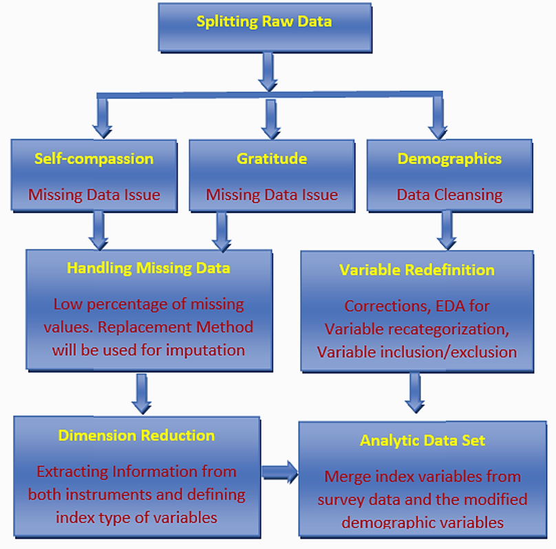

```{=html}
<style type="text/css">

div#TOC li {
    list-style:none;
    background-image:none;
    background-repeat:none;
    background-position:0;
}
h1.title {
  font-size: 24px;
  font-weight: bold;
  color: DarkRed;
  text-align: center;
}
h4.author { /* Header 4 - and the author and data headers use this too  */
  font-size: 18px;
  font-family: "Times New Roman", Times, serif;
  font-weight: bold;
  color: DarkRed;
  text-align: center;
}
h4.date { /* Header 4 - and the author and data headers use this too  */
  font-size: 18px;
  font-weight: bold;
  font-family: "Times New Roman", Times, serif;
  color: DarkBlue;
  text-align: center;
}

h1 { /* Header 3 - and the author and data headers use this too  */
    font-size: 20px;
    font-weight: bold;
    font-family: "Times New Roman", Times, serif;
    color: darkred;
    text-align: center;
}
h2 { /* Header 3 - and the author and data headers use this too  */
    font-size: 18px;
    font-weight: bold;
    font-family: "Times New Roman", Times, serif;
    color: navy;
    text-align: left;
}

h3 { /* Header 3 - and the author and data headers use this too  */
    font-size: 16px;
    font-family: "Times New Roman", Times, serif;
    font-weight: bold;
    color: navy;
    text-align: left;
}

</style>
```


```{r setup, include=FALSE}
if (!require("tidyverse")) {
   install.packages("tidyverse")
   library(tidyverse)
}
if (!require("GPArotation")) {
   install.packages("GPArotation")
   library(GPArotation)
}
if (!require("nFactors")) {
   install.packages("nFactors")
   library(nFactors)
}
if (!require("parameters")) {
   install.packages("parameters")
   library(parameters)
}
if (!require("corrplot")) {
   install.packages("corrplot")
   library(corrplot)
}
if (!require("ggcorrplot")) {
   install.packages("ggcorrplot")
   library(ggcorrplot)
}
if (!require("ggfortify")) {
   install.packages("ggfortify")
   library(ggfortify)
}
if (!require("ggplot2")) {
   install.packages("ggplot2")
   library(ggplot2)
}
if (!require("GGally")) {
   install.packages("GGally")
   library(GGally)
}
if (!require("GGally")) {
   install.packages("GGally")
   library(GGally)
}
if (!require("CCA")) {
   install.packages("CCA")
   library(CCA)
}
if (!require("olsrr")) {
   install.packages("olsrr")
   library(olsrr)
}
if (!require("psych")) {
   install.packages("psych")
   library(psych)
}
if (!require("cocron")) {
   install.packages("cocron")
   library(cocron)
}
if (!require("knitr")) {
   install.packages("knitr")
   library(knitr)
}
if (!require("pander")) {
   install.packages("pander")
   library(pander)
}
##
knitr::opts_chunk$set(echo = TRUE,       
                      warnings = FALSE,   
                      results = TRUE,   
                      message = FALSE,
                      fig.align='center', 
                      fig.pos = 'ht')
```


\


# Introduction

The goal of this research project is to measure the level of self-compassion as well as the self-care of BSW and MSW students in a Social Work Program at a regional University. We will be using the following two reliable and validated instruments to measure their level of self-compassion and self-care as they immerse themselves in the helping profession. We hope to see how the SC of the students correlates to other independent variables i.e. undergrad/grad program social work, age, education level, religiosity, spirituality, gender, etc.

1. The Self-Compassion Scale

2. The Gratitude Questionnaire

The purpose of our research is to study the perception of self-compassion in social work students and how it can link to self-care as well as success in the social work program and field. This will help provide students with self-care practices during their training to thrive in the profession in the future.


# Data Management and Analyzing Survey Instruments

\

The next chart illustrates the data management workflow to create the analytic data set.

```{r fig.align='center', out.width = '50%'}

```


```{r}
survey = read.csv("w11-SurveyDataCsvFinal.csv", head = TRUE)
# names(survey)
```

The original survey data have three components, a self-compassion scale,  gratitude questionnaire instruments, and some demographic questions. 

The three components have different portions of missing values. We split the original data set into three subsets of data and imputed the missing values related to the self-compassion and gratitude data based on the survey instruments. Since there are only a few missing values, we replace the missing values in each survey question with the mode of the associated survey item. We create indexes of the two instruments separately to aggregate the information in the two survey data sets. 

Since R does not have a function to find the model of a given data set, I write the following function to find the model of a data set.

We will perform both principal component analysis (PCA) and exploratory factor analysis (EFA).


```{r}
my.mode = function(dataset){
  freq.tbl = table(dataset)
  max.freq.id=which(freq.tbl==max(freq.tbl))
  mode=names(freq.tbl[max.freq.id])
  as.numeric(mode)
}
```

## Handling Missing Values Self-Compassion Instrument

This instrument contains only the data associated with the 12 items in the survey instrument. In the original data file, the 12 variables are named Q2_1, Q2_2, ..., Q2_12. We impute the missing value by replacing the missing value in each of the 12 items with the mode of the corresponding survey items. Since there are only a few missing values in this instrument, this imputation will not impact the subsequent PCA and EFA.  

```{r}
compassion = survey[, 1:12]
# Imputing with the mode in each survey item
for (i in 1:12) {
  compassion[,i][is.na(compassion[,i])]=my.mode(compassion[,i])
}
```

## Handling Missing Values in Gratitude Scale

The gratitude questionnaire contains only the variables associated with gratitude questions. The variables used in the original data file are Q3_1, Q3_2, ..., Q3_6. We use the same mode imputation method to fill in the missing values as used in the above self-compassion survey data. The gratitude questionnaire has even fewer missing values. Any imputation will not impact any subsequent analysis.

```{r}
gratitude = survey[, 13:18]
# Imputing with the mode in each survey item
for (i in 1:6) {
  gratitude[,i][is.na(gratitude[,i])]=my.mode(gratitude[,i])
}
```

Since Likert scales of the Q3_3 and Q3_6 were in **reverse order** in the design. We transform back the usual order and create a new dataset using the same variable names.

```{r}
gratitude.new = gratitude
gratitude.new$Q3_3 = 8-gratitude$Q3_3
gratitude.new$Q3_6 = 8-gratitude$Q3_6
```

## Handling Demographic Variables


The demographic variables have two issues: missing values and imbalance categories. Since the size of the data set is slightly close to 120, imputing missing values in a meaningful way is crucial to maintaining the sample size and the statistical power of all subsequent association analyses. About 15 records in the data sets do not have demographic information. Therefore these records were deleted from the final data. 

A few missing values occurred in the years of education and employment that are imputed using the auxiliary information in the variables of age, the years of education, and the length of employment. 

The major issue of these categorical variables is the imbalance category. The following modifications to the original demographic variables are utilized.


```{r}
demographic = survey[, -(1:18)]
demographic00=demographic
# replace missing values with 99.
demographic00[is.na(demographic00)] <- 99  
# Create a frequency table for collapsing categories
#list(Q8.1=table(demographic00$Q8_1),
#     Q8.2=table(demographic00$Q8_2),
#     Q8.3=table(demographic00$Q8_3),
#     Q8.5=table(demographic00$Q8_5),
#     Q8.6=table(demographic00$Q8_6),
#     Q.9=table(demographic00$Q9),
#     Q.11=table(demographic00$Q11),
#     Q.13=table(demographic00$Q13),
#     Q.14=table(demographic00$Q14),
#     Q.15=table(demographic00$Q15),
#     Q.16=table(demographic00$Q16),
#     Q.17=table(demographic00$Q17),
#     Q.18=table(demographic00$Q18),
#     Q.19=table(demographic00$Q19),
#     Q.20=table(demographic00$Q20)
#     )
```


```{ }
grp.age = Q8_1:  1 = (3,23], 2 = [24, 30],  3 = [31, 59]
grp.edu = Q8_2:    1 = [0,15] associate, 2 = [15.5,18.5] bachelor, 3 = [19, 25]  advdegree
grp.empl = Q8_3:   1 = [0,5]  entry, 2 = [5.5,10] junior, 3 = [10.5, 35]   senior
kid.num = Q8_5: 1 = (0) No child, 2 = at least one child
home.size = Q8_6:  1 = (1), 2 = (2), 3 = 3 or more

gender = Q9:  1 = (2) female, 2 = (1,3,5,7) male 
race = Q11:   1 = (1)   white,   2 = (2,3) other
marital.st = Q13: 1 = (1) single, 2 = (2) married/civil Partner, 3 = other
disability = Q14:  1 = yes,  2 = No
religion = Q15:  1 = 9 (no religion), 2 = (1,2,3,6,7,8,10,11,99) (religion)
Sexual.orient = Q16:  1 = (4)  heterosexual,  2 = (1,2,3,5,6,7,10) other
poli.affil = Q17: 1 = (4)ind, 2 = (5,6,7)  democrats, 3 = (1,2,3, 99) other
SW.Program = Q18: 1 = (1) BSW, 2 = (2,99) MSW
Urbanity = Q19:  1 = (1) urban, 2 = (2) rural, 3 = (3) suburban
Spirituality = Q20: 1 = (1,2,3) low, 2 = (4)   moderate,  3 = (5,6,7) high
```

We re-define the demographic variables based on the above modification. The modified demographic variables will be used in subsequent modeling.

```{r}
Q8.1=demographic00$Q8_1
grp.age=cut(Q8.1, breaks=c(1, 23, 30, 100), labels=c("[1,23]", "[24,30]", "[30,99]"))
#
Q8.2=demographic00$Q8_2
grp.edu=cut(Q8.2, breaks=c(0, 15.5, 19, 100), labels=c("Assoc", "Bachelor", "Adv.deg"))
#
Q8.3=demographic00$Q8_3
grp.empl=cut(Q8.3, breaks=c(-1,5, 9, 100), labels=c("entry", "junior", "senior"))
#
Q8.5=demographic00$Q8_5
kid.num=cut(Q8.5, breaks=c(-1,1,100), labels=c("No-kid", "With-kid"))
#
Q8.6=demographic00$Q8_6
home.size=cut(Q8.6, breaks=c(-1,2,100), labels=c("1-2", "3+"))
#
Q.9=demographic00$Q9
gender=rep("male", length(Q.9))
gender[which(Q.9==2)]="female"
#
Q.11=demographic00$Q11
race=rep("other", length(Q.11))
race[which(Q.11==1)]="white"
#
Q.13=demographic00$Q13
marital.st = rep("other", length(Q.13))
marital.st[which(Q.13==1)]="single"
marital.st[which(Q.13==2)]="married"
#
Q.14=demographic00$Q14
disability=rep("yes", length(Q.14))
disability[which(Q.14==2)]="no"
#
Q.15=demographic00$Q15
religion=rep("religion", length(Q.15))
religion[which(Q.15==1)]="no-religion"
#
Q.16=demographic00$Q16
sexual.orient=rep("other", length(Q.16))
sexual.orient[which(Q.16==4)]="heterosexual"
#
Q.17=demographic00$Q17
poli.affil = rep("Republican", length(Q.17))
poli.affil[Q.17 %in% c(5,6)]="ModDemocrats"
poli.affil[Q.17 %in% c(7)]="StrongDemocrats"
poli.affil[which(Q.17 ==4)]="independent"
#
Q.18=demographic00$Q18
SW.program=rep("MSW", length(Q.18))
SW.program[which(Q.18==1)]="BSW"
#
Q.19=demographic00$Q19
urbanity=rep("urban", length(Q.19))
urbanity[which(Q.19==2)]="rural"
urbanity[which(Q.19==3)]="suburban"
#
Q.20=demographic00$Q20
spirituality=rep("high", length(Q.20))
spirituality[which(Q.20==2)]="moderate"
spirituality[Q.20 %in% c(1,2,3)]="low"
#
new.demographics=data.frame(grp.age, grp.edu, grp.empl, kid.num, home.size, gender, race,
           marital.st, disability, religion, sexual.orient, poli.affil,
           SW.program, urbanity, spirituality)
#new.demographics
```


# Validity and Reliability Analyses

This section reports measures of validity and reliability of the two survey instruments: self-compassion and gratitude.


## Self-compassion Instrument

The Self-Compassion Scale (SCS), developed by Kristin Neff in 2003, is a widely used instrument that measures self-compassion through six key subscales, which can be grouped into two overarching (not opposite) dimensions:

* **Self-Compassion** (positive, adaptive responses): Treating oneself with warmth, recognizing shared human struggles, and maintaining emotional balance.	
  + Self-Kindness (**SK**)
    - Item 3: *when something painful happens, I try to take a balanced view of the situation.*
    - Item 7: *when something upsets me, I try to keep my emotions in balance.*
  + Common Humanity (**CH**)
    - Item 5: *I try to see my failings as part of the human condition.*
    - Item 10: *When I feel inadequate in some way, I try to remind myself that feelings of inadequacy are shared by most people.*
  + Mindfulness (**MD**)
    - Item 2: *I try to be understanding and patient towards those aspects of my personality I don't like.*
    - Item 6: *When I am going through a very hard time. I give myself the caring and tenderness I need.*


* **Self-Coldness** (negative, harsh responses): Being self-critical, feeling alone in suffering, and obsessing over negative emotions.
  + Self-Judgment (**SJ**)
    - Item 11: *I am disapproving and judgmental about my own flaws and inadequacies.*
    - Item 12: *I am intolerant and impatient towards those aspects of my personality I don't like.*
  + Isolation (**IS**)
    - Item 4: *When I am feeling down, I tend to feel like most other people are probably happier than I am.*
    - Item 8: *When I fail at something that is important to me, I tend to feel alone in my failure.*
  + Over-Identification (**OI**)
    - Item 1: *When I fail at something important to me, I become consumed by feelings of inadequacy.*
    - Item 9: *When I am feeling down, I tend to obsess and fixate on everything that is wrong.*


We start with some correlation plots to see the relevance of the PCA procedure on the self-compassion data. 


```{r fig.width = 6, fig.height = 6, fig.cap="The pairwise correlation plot reveals the potential relevance of PCA. The shape of an ellipse represents the correlation. The skinnier the ellipse, the higher the correlation. The direction reflects whether a correlation is positive or negative. The off-diagonal direction implies s positive correlation while the main diagonal direction implies a negative association."}
##
M=cor(compassion)
corrplot.mixed(M, lower.col = "purple", upper = "ellipse", number.cex = .7, tl.cex = 0.7)
```

Figure 1 shows the moderate association between individual survey items. This implies that the PCA is relevant in aggregating the information in the survey items. 


Similar to López et. al. (2018), we use the six positive items associated with mindfulness, self-kindness, and the sense of common humanity to define the self-compassion index. 


From the pair-wise correlation plot, we can see that some of the items are reversely scored. We next change back the scale so that all items are positively correlated.

```{r}
###
selfcomp = cbind(compassion$Q2_3, compassion$Q2_7, compassion$Q2_10,
                 compassion$Q2_5,compassion$Q2_2,compassion$Q2_6)
###
selfcold =  cbind(compassion$Q2_1, compassion$Q2_9, compassion$Q2_4,
                 compassion$Q2_8,compassion$Q2_11,compassion$Q2_12)

###  MD = Mindfulness, SK = Self-kindness, CH = sense of common humanity
selfcomp.sub = cbind(MD1=compassion$Q2_3, MD2=compassion$Q2_7, 
                     CH1=compassion$Q2_10,CH2=compassion$Q2_5,
                     SK1=compassion$Q2_2,SK2=compassion$Q2_6)

### SJ = self-judement OI = Over-identification, IS = Isolation
selfcold.sub =  cbind(OI1=compassion$Q2_1, OI2=compassion$Q2_9, 
                     IS1=compassion$Q2_4, IS2=compassion$Q2_8,
                     SJ1=compassion$Q2_11,SJ2=compassion$Q2_12)
### Simple sum and average
selfcomp.sum = compassion$Q2_3 + compassion$Q2_7 + compassion$Q2_10 +
                 compassion$Q2_5 + compassion$Q2_2 + compassion$Q2_6
selfcomp.avg = selfcomp.sum/6
```


```{r fig.width = 6, fig.height = 6, fig.cap="The pairwise correlation plot reveals the potential relevance of PCA. Group items based on self-compassion and self-coldness"}
##
M=cor(cbind(selfcomp.sub, selfcold.sub))
corrplot.mixed(M, lower.col = "purple", upper = "ellipse", number.cex = .7, tl.cex = 0.7)
```

Next, we make the following heatmap to illustrate the pairwise correlation between the items in the survey instrument based on the positive adjustment of the scale. 


```{r fig.cap="Pairwise correlation based on negatively adjusted subscales. The shape of an ellipse represents the correlation. The skinnier the ellipse, the higher the correlation. The direction reflects whether a correlation is positive or negative. The off-diagonal direction implies s positive correlation while the main diagonal direction implies a negative association."}
##
M=cor(selfcomp.sub)
corrplot.mixed(M, lower.col = "purple", upper = "ellipse", number.cex = .7, tl.cex = 0.7)
```


**Intern Consistency**

With the adjusted scores in the self-compassion instrument, we calculate one of the commonly used internal consistency reliability Cronbach alpha as follows.

Next, we find the Cronbach alpha and its 95% confidence interval.

```{r}
cronbach.sc = as.numeric(alpha(selfcomp.sub)$total[1])
CI.sc = cronbach.alpha.CI(alpha=cronbach.sc, n=104, items=6, conf.level = 0.95)
CI.comp = cbind(LCI = CI.sc[1], alpha = cronbach.sc, UCI =CI.sc[2])
row.names(CI.comp) = ""
pander(CI.comp, caption="Confodence Interval of Cranbach Alpha")
```


We can see that Cronbach's alpha is 0.77 with a 95% confidence interval (0.70, 0.84) suggesting that the items in the self-compassion instrument have relatively high internal consistency. 


## Gratitude Questionaire

In this section, we perform the same analysis on the gratitude survey instrument. First of all, we present a pairwise correlation plot to display the correlation between individual survey items in the gratitude survey instrument.

```{r fig.cap="The pairwise correlation plot reveals the potential relevance of PCA for the gratitude instrument. The shape of an ellipse represents the correlation. The skinnier the ellipse, the higher the correlation. The direction reflects whether a correlation is positive or negative. The off-diagonal direction implies s positive correlation while the main diagonal direction implies a negative association."}
##
M1=cor(gratitude.new)
#corrplot(M, type = "upper", method = "ellipse", main="Pairwise Correlation Plot: Self-Compassion Scale")
corrplot.mixed(M1, lower.col = "purple", upper = "ellipse", number.cex = .7, tl.cex = 0.7)
```


Figure 3 shows that a moderate correlation exists between individual variables. This implies the PCA and EFA can be used to aggregate the information in the set original survey items. Next, we estimate the number of PCAs or EFAs to be retained for the subsequent analysis using the commonly used procedures and summarize the results in the following Figure 4.


**Cronbach's Alpha**

The internal consistency measure, Cronbach's alpha, of the gratitude instruments calculated below

```{r}
cronbach.gr = as.numeric(alpha(gratitude.new)$total[1])
CI.gr = cronbach.alpha.CI(alpha=cronbach.gr, n=104, items=6, conf.level = 0.95)
CI.gratitude = cbind(LCI = CI.gr[1], alpha = cronbach.gr, UCI =CI.gr[2])
row.names(CI.gratitude) = ""
kable(CI.gratitude, caption="Confodence Interval of Cranbach Alpha")
```


We can see that Cronbach's alpha is 0.8 with a 95% confidence interval (0.74, 0.86) also suggesting that the items in the Gratitude rating instrument have relatively high internal consistency.

