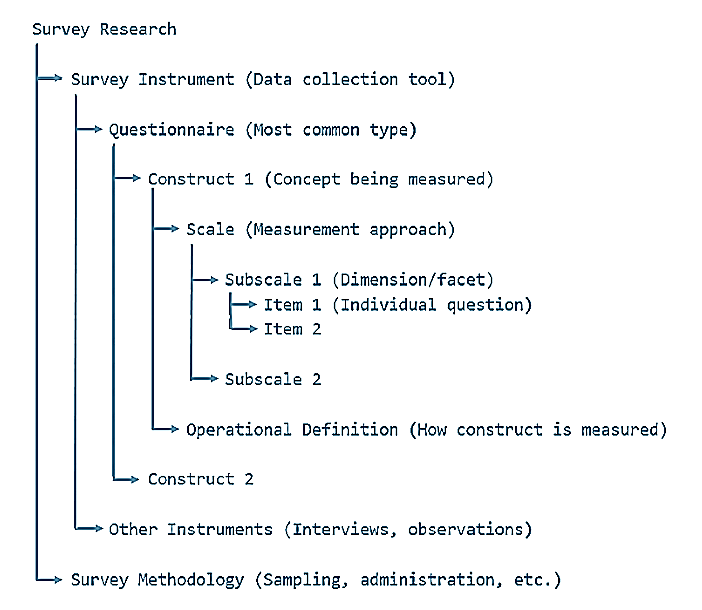

<style type="text/css">

div#TOC li {
    list-style:none;
    background-image:none;
    background-repeat:none;
    background-position:0;
}

h1.title {
  font-size: 20px;
  color: DarkRed;
  text-align: center;
}
h4.author { /* Header 4 - and the author and data headers use this too  */
    font-size: 18px;
  font-family: "Times New Roman", Times, serif;
  color: DarkRed;
  text-align: center;
}
h4.date { /* Header 4 - and the author and data headers use this too  */
  font-size: 18px;
  font-family: "Times New Roman", Times, serif;
  color: DarkBlue;
  text-align: center;
}
h1 { /* Header 3 - and the author and data headers use this too  */
    font-size: 22px;
    font-family: "Times New Roman", Times, serif;
    color: darkred;
    text-align: center;
}
h2 { /* Header 3 - and the author and data headers use this too  */
    font-size: 18px;
    font-family: "Times New Roman", Times, serif;
    color: navy;
    text-align: left;
}

h3 { /* Header 3 - and the author and data headers use this too  */
    font-size: 15px;
    font-family: "Times New Roman", Times, serif;
    color: navy;
    text-align: left;
}

h4 { /* Header 4 - and the author and data headers use this too  */
    font-size: 18px;
    font-family: "Times New Roman", Times, serif;
    color: darkred;
    text-align: left;
}
</style>

```{r setup, include=FALSE}
if (!require("psych")) {
   install.packages("psych")
   library(psych)
}
if (!require("cocron")) {
   install.packages("cocron")
   library(cocron)
}
if (!require("knitr")) {
   install.packages("knitr")
   library(knitr)
}
if (!require("pander")) {
   install.packages("pander")
   library(pander)
}
##
knitr::opts_chunk$set(echo = TRUE,       
                      warnings = FALSE,   
                      results = TRUE,   
                      message = FALSE,
                      fig.align='center', 
                      fig.pos = 'ht')
```


\

# Introduction

A **survey instrument** is a *structured tool* used to collect data from respondents, typically consisting of a set of questions. Several concepts are key to understanding the design of surveys.  

* A **questionnaire** is a structured research tool consisting of a set of written questions designed to collect data from respondents. 

* A **construct** is an abstract concept being measured (e.g., satisfaction, trust) through single or multi-item questionnaires.

* **Operationalization** is the process of defining how to measure a construct. That is, it bridges construct and questionnaire.

* **Single-item measure** uses one question measuring a construct. It is used only for simple, unambiguous constructs.

* A **Multiple-item measure** uses several questions measuring one construct. It is good for complex or multidimensional constructs.

* A **scale** is a set of items (questions) designed to measure a construct, often using a standardized response system (e.g., Likert scales). It could be either a single (overall rating) or multiple (multi-dimensional information) scale.

* A **subscale** is a subset of items within a scale that measures a specific dimension of the construct.


```{r echo = FALSE, out.width="70%"}

```

This brief note primarily focuses on the reliability of the survey instrument a survey. Since discussing the reliability of a survey is meaningless if it is invalid. So we will also briefly discuss the validity of a survey instrument.

In other words, for the survey results to be useful, the survey must demonstrate both reliability and validity.

* **Validity** – This is the extent to which a survey question measures <font color = "red"><b>what it is supposed to measure</b></font>.

* **Reliability** – This is the extent to which <font color = "red"><b> repeatedly </b></font>measuring the <font color = "red"><b> same </b></font> thing produces the <font color = "red"><b> same </b></font> result.

Although validity and reliability are viewed as completely separate ideas, the two are related. We can use the following diagram to illustrate the relationship. 


```{r echo=FALSE, fig.align='center', fig.cap="Figure 1: Validity vs reliability of a survey instrument", out.width = '40%'}

```


Next, we briefly describe the types of validity and primarily focus on the reliability of the survey instrument. 


# Validity

Before we discuss the validity, we first introduce the concept of operationalization. According to Wikipedia,

>In research design, especially in psychology, social sciences, life sciences, and physics, operationalization is a process of defining the measurement of a phenomenon that is not directly measurable, though its existence is inferred by other phenomena.


Operationalization is the process by which researchers translate theoretical variables into observable and measurable procedures.


## Types of validity

As mentioned earlier, in survey design, a <font color = "red">**construct**</font> is the abstract idea, the underlying theme, or subject matter that one wishes to measure using survey questions. 

There are many different versions of descriptions of different types of validity. The following are modern descriptions of the validity of the survey construct.


* **Content Validity** – An operationalization has **content validity** when it adequately covers the range of meanings included in the construct it is intended to measure. When assessing this, one should also consider the content relevance of each item and its technical quality.


* **Substantive Validity** considers the strength of the theoretical rationales for interpreting the survey scores.


* **Structural Validity** is assessed by investigating the degree to which the operationalization adequately reflects the dimensionality of the construct to be measured.


* **Generalizability** examines the extent to which scores generalize across different population groups, different situations or settings, different periods, and/or other operationalizations representative of the construct domain.


\

## Improving Validity

The strategy for improving the validity of survey instruments is to **reduce (or even avoid) bias**. The following are **common potential biases** in questionnaire design. 


* **Deliberate bias** - If the objective of a survey study is to support a certain cause, the creators of the survey may deliberately try to influence the results by using questions that are purposefully worded in a biased manner.


* **Unintentional bias** - One way that this can occur is when questions are worded in such a way that the meaning is misinterpreted by a large proportion of the respondents. This can often happen inadvertently when words have multiple meanings or when words are interpreted differently than intended.


* **Social desirability bias** - In general, respondents tend to respond to questions with answers they think will be viewed favorably by others. This involves both understating behaviors/opinions that are viewed negatively and overstating behaviors/opinions that are viewed positively. Careful wording of questions or utilizing certain randomized response techniques can help reduce this bias. Here are things that may be misreported:
  - Abilities and skills
  - Personality
  - Religion and spirituality
  - Financial earning
  - Unlawful behavior
  - Other very personal things


* **Non-Response Bias** - occurs where a survey sample is non-representative of the target population. In these cases, the opinions shared by those respondents are disproportionate to those of the larger population. To reduce the risk of this bias occurring, we can share the survey across a range of platforms and to a diverse group as possible. E.g. social media, website, via email, etc.


* **Uninformed response bias** - Sometimes, respondents claim to know something about an issue because they are embarrassed to admit that they don’t. To avoid this type of bias, be sure to keep the survey questions clear of technical jargon, and clearly define any terms that need to be defined.


* **Complex bias** - is the tendency to look at something easy to understand, or look at it when we are in a state of confusion, and view it as having many parts that are difficult to understand. Questions should be worded as simply and clearly as possible. If technical jargon must be used, it is best to define the term specifically in the survey. Finally, we should **avoid** using double-barreled questions in any survey.

\

# Reliability

For survey results to be useful, the survey must demonstrate reliability. The best practice for questionnaire design is to help maximize the instrument’s reliability.

Based on the definition given earlier, reliability is a quality measure of the survey instrument. We can use quantitative approaches to analyze the reliability of the survey. There are several different types of reliability measures available in literature and practice. We will introduce some commonly used ones.


## Test-Retest Reliability

We estimate test-retest reliability when we administer the same questionnaire (or test) to the <font color = "red">**same set of subjects**</font> on two different occasions. Note that this approach assumes there is no substantial change in what is being measured between the two occasions. To maximize the chance that what is being measured is not changing, one should not let too much time pass between the test and the retest. 

For continuous scale, measures such as Pearson correlation can be used to assess the strength of reliability. For a categorical scale, Kappa-related statistics can be used.


## Parallel Forms Reliability

This involves creating a large set of questions that are believed to measure the same construct and then randomly dividing these questions into two sets (known as parallel forms). Both sets are then administered to the <font color = "red">**same group of people**</font>. The means, standard deviations, and correlations with other measures (when appropriate) should be compared to establish that the two forms are equivalent. The correlation between the two parallel forms can be used as the estimate of reliability (we want the scores on the two forms to be highly correlated).


Having parallel forms is useful for studies involving both a pre-test and post-test in which the researcher does not want to use the same form at both periods (think of why they may want to avoid this). If parallel forms reliability can be established, then the researcher can use both forms in their study.


## Internal Consistency Reliability

In internal consistency reliability estimation, we use our single measurement instrument administered to a group of people on one occasion to estimate reliability. In effect, we judge the reliability of the instrument by estimating how well the items that reflect the same construct yield similar results. We are looking at how consistent the results are for different items for the same construct within the measure. 

Different internal consistency measures can be used. The following are commonly used in practice.


### Average Inter-item Correlation

The average inter-item correlation uses all of the items on our instrument that are designed to measure the same construct. We first compute the correlation between each pair of items. The average inter-item correlation is simply the average or mean of all these correlations. 

For example,  we have six items in the gratitude survey. There are 15 different item pairings (i.e., 15 correlations). We take the average of all 15 correlation coefficients as illustrated in the following figure.

```{r echo=FALSE, fig.align='center', fig.cap="Figure 2: Inter-item correlation", out.width = '40%'}

```

**Caution**: To get truthful information from respondents, researchers often intentionally reverse the scale. In this case, we need to calculate the mean absolute correlation. 


### Cronbach’s Alpha ($\alpha$)

Cronbach’s Alpha is the most commonly used measure of reliability in practice. The mathematical formula of the Cronbach Alpha is given by

$$
\alpha = \frac{N\times \bar{c}}{\bar{\nu} + (N-1)\times \bar{c}}
$$

where

* N = the number of items.
* $\bar{c}$ = average covariance between item-pairs.
* $\bar{\nu}$ = average variance.

**Note**: As the sample size $N$ increase, $\alpha$ goes to 1.

The use of the Cronbach Alpha is summarized in the following table.

```{r echo=FALSE, fig.align='center', fig.cap="Figure 3. Cronbach Alpha Table", out.width = '40%'}
include_graphics("img/w11-Cronbach-Alpha.jpg")
```

### R function for Calculating Cronbach Alpha

You can write a simple R function based on the above formula to calculate Cronbach's Alpha. Several R libraries have functions to calculate Cronbach's alpha and corresponding confidence intervals. For example **alpha()** in library **{psych}**.

The following code demonstrates how to calculate Cronbach's Alpha using the R function in library **{psych}**. The data set to be used in the following example can be found at <https://raw.githubusercontent.com/pengdsci/STA490/main/w11-CronbachAlpha-dataset.csv>


### Data Structure For Calculating Cronbach Alpha

From the definition of Cronbach's Alpha, we can see that only items within the same scale can be used. If a survey instrument has several scales, we should group items according to their corresponding scales (even sub-scales) and then calculate Cronbach's Alpha separately.

In the above data, variables 2-4 are at the same scale. So we define a data frame that contains only the three items (variables) at the sample scale to calculate Cronbach's Alpha of the scale.


```{r}
# need to load package {psych} first.
example.data = read.csv("https://pengdsci.github.io/STA490/w11/w11-CronbachAlpha-dataset.csv")
my.scale = example.data[, 2:4]
cronbach.a = as.numeric(alpha(my.scale)$total[1])
CI.sc = cronbach.alpha.CI(alpha=cronbach.a, n=104, items=6, conf.level = 0.95)
CI.comp = cbind(LCI = CI.sc[1], alpha = cronbach.a, UCI =CI.sc[2])
row.names(CI.comp) = ""
pander(CI.comp, caption="Confodence Interval of Cranbach Alpha")
```


### Interpretation of Cronbach’s Alpha

Cronbach's $\alpha$ is also called the coefficient of reliability that ranges from 0 to 1. It provides the overall assessment of a measure’s reliability of the underlying scale. 

* If all of the scale items are entirely independent of one another (i.e., are not correlated or share no covariance), then  $\alpha$  = 0; 

* if all of the items have high covariances, then  $\alpha$  will approach 1 as the number of items in the scale approaches infinity. 

In other words, the higher the  $\alpha$  coefficient, the more the items have shared covariance and probably measure the same underlying concept.


# Methods of Survey Administration

There are three major ways of administering a survey. Which one is used is dependent on the scope of the study and factors such as project budget, characteristics of the study population, the sampling frame, desired response rate, and the characteristics of the survey, etc.


* **Face-to-face interviews.**  This involves the oral presentation of survey questions by a well-trained interviewer. Computer-Assisted Personal Interviewing (CAPI) software is often used, which reduces some types of interviewer error.


* **Telephone interviews.**  This also involves the oral presentation of survey questions by a well-trained interviewer, but it is conducted over the phone instead of in person. Computer-Assisted Telephone Interviewing (CATI) is often used.


* **Self-administered questionnaires.** This requires respondents to complete a written questionnaire without any guidance from an interviewer. Sometimes, such questionnaires are printed on paper and mailed out with instructions. Other times, such surveys are conducted via a Computer-Assisted Self-Interview (CASI).

